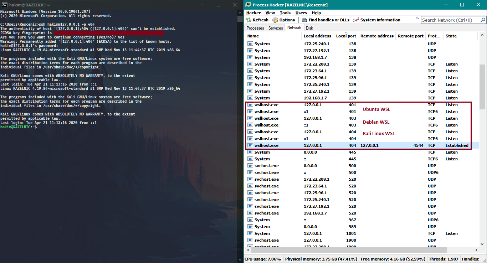

# WSL 服务自启动脚本
支持在Windows启动时启动WSL中的Linux服务.<br/>
其他功能包括：在Windows启动时运行“ Ubuntu”，“ Debian”和“ Kali Linux”。 参见`control.bat`。<br/>
例如，我为“ Ubuntu 401”，“ Debian 403”和“ Kali Linux 404”设置了SSH端口。<br/>



[README](README.md) | [中文文档](README_zh.md)

## 目录

* [安装](#安装)
* [使用](#使用)

## 安装

* 使用 git clone 到任意目录 (e.g `C:\wsl-autostart`)
``` shell
git clone https://github.com/rescenic/wsl-autostart.git
```

* 在注册表中加入启动项 <br/>


* 在`HKEY_LOCAL_MACHINE\SOFTWARE\Microsoft\Windows\CurrentVersion\Run`下新增字符串项目 (e.g `WSLAutostart`) <br/>


* 设定脚本的路径 (e.g `C:\wsl-autostart\start.vbs`) <br/>


## 使用

* 修改在WSL中`/etc/sudoers`文件,为需要自启动的服务指定为免密码.
如:
``` sudoers
%sudo ALL=NOPASSWD: /etc/init.d/cron
%sudo ALL=NOPASSWD: /etc/init.d/ssh
#%sudo ALL=NOPASSWD: /etc/init.d/mysql
#%sudo ALL=NOPASSWD: /etc/init.d/apache2

%wheel ALL=NOPASSWD: /etc/init.d/cron
%wheel ALL=NOPASSWD: /etc/init.d/ssh
#%wheel ALL=NOPASSWD: /etc/init.d/mysql
#%wheel ALL=NOPASSWD: /etc/init.d/apache2

https://support.hostway.com/hc/en-us/articles/115001509750-How-To-Install-and-Configure-Sudo
```
* 修改`commands.txt`文件指定需要自启动的服务.
如:
``` shell
/etc/init.d/cron
/etc/init.d/ssh
#/etc/init.d/mysql
#/etc/init.d/apache2
```

## 其他方法
* 使用 `gpedit.msc`，可以定义在计算机启动时运行的程序。
  > 请注意，配置的程序将以系统用户身份运行。
* 使用 `taskschd.msc`，可以在计算机启动后安排任务。
  > 您可以配置哪个用户将运行该程序，运行前的延迟以及重试次数。
相同的 `taskschd.msc` 程序将显示有关任务执行的特定日志

## Further reading: Install 'SSH' on 'WSL'
* https://superuser.com/questions/1111591/how-can-i-ssh-into-bash-on-ubuntu-on-windows-10
* https://gist.github.com/dentechy/de2be62b55cfd234681921d5a8b6be11
* https://gist.github.com/harleyday/76a103a1a0ca97c6f33706e4a8cc3307#file-wsl-ssh-server-md